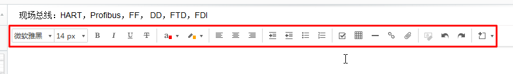
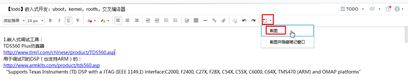
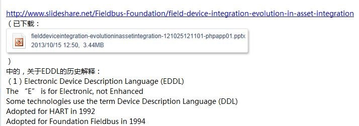
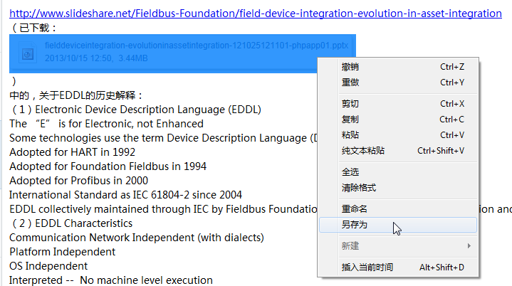
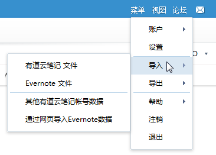
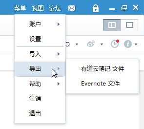
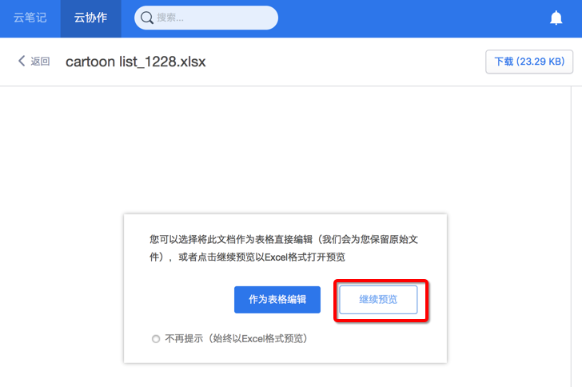
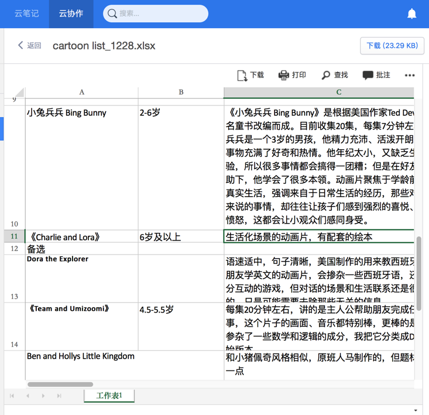

# 通用功能

下面介绍**有道云笔记**和**有道云协作**中通用的、好用的功能：

* 分享方便
    * 直接有分享按钮，分享得到网页的链接，别人直接用任何浏览器打开链接即可查看内容
        * 相比之下的印象笔记的分享，只能发送给对方邮箱，而且对方也需要注册了印象笔记，分享很不方便
        * 企业版的话，分享还可以设置编辑的权限
* 支持Markdown
    * 轻量级的写文档的方式
        * 相比之下，印象笔记就没有完全支持markdown

## 基本的编辑功能
作为文本编辑器，对于普通的内容的编辑，还是支持的不错的。

不论是复制粘贴。

还是输入内容。

各种编辑功能：

## 方便的截图和插入图片

内置支持截图并直接插入图片：

> #### warning::Web版中Mac的Safari不支持插入图片
>
> Web版中，对于上传文件来说，Mac中Chrome浏览器才支持，而Safari中不支持上传图片

## 对于文件当做附件的支持，很方便
比如：

想要把一个外部的文件，当做当前编辑的贴子的附件

则可以在Windows中，直接复制文件，然后粘贴到当前帖子中，即可。效果如图：

点击选择粘贴的文件后右击，可以另存为：

## 内置支持待办事项

效果还是不错的。

## 支持各种不同的格式的导入导出
支持，导入，导出，各种格式：
* 有道云笔记 文件
* Evernote 文件
等等

## 支持在线预览

常见的格式都支持在线预览

比如：

### PDF

### Excel

## 表格

有道最新版本支持自己的表格，无需（像excel文件）另外下载，即可在线编辑，对于内容不多的表格，使用在线表格，还是比较方便的。

新建表格的入口：

在线表格的效果：

