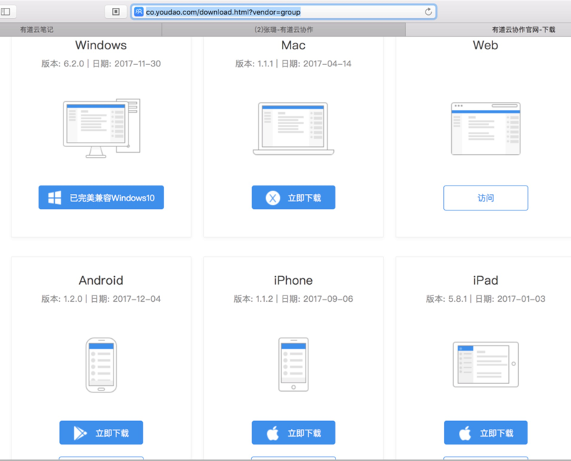

# 下载和登录系统

有道云笔记分多种版本：
* Web版=网页版
* 客户端
  * PC端
    * Windows
    * Mac
  * 移动端
    * iOS
      * iPhone
      * iPad
    * Android

## Web端无需下载客户端而直接登录
如果是直接使用在线的Web网页版的话，无需下载客户端，直接去：

[有道云协作的web网页版](https://note.youdao.com/signIn/group.html)

登录即可。

## 下载
如果是需要安装客户端，再去下载和安装。

去官网下载：

[有道云协作官网-下载](http://co.youdao.com/download.html)

自己所需要的版本后，并安装。

> **[info] 版本提示**
> * `Windows版`：**一个**桌面客户端软件，包括了 **有道云笔记** 和 **有道云协作**
> * `Mac版`：**有道云笔记** 和 **有道云协作** 是**两个独立**的客户端软件
