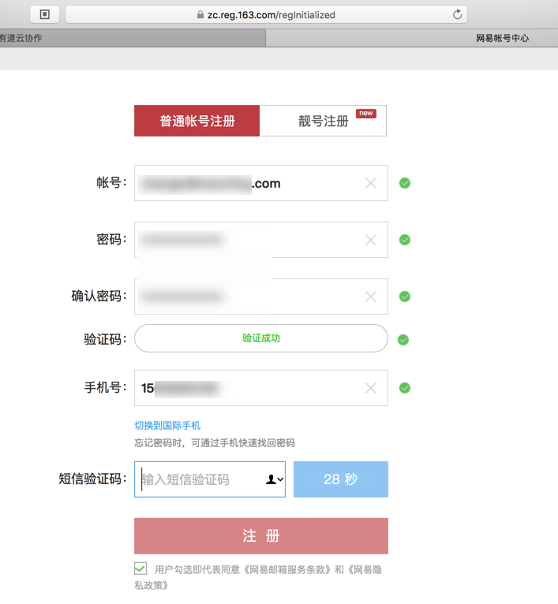
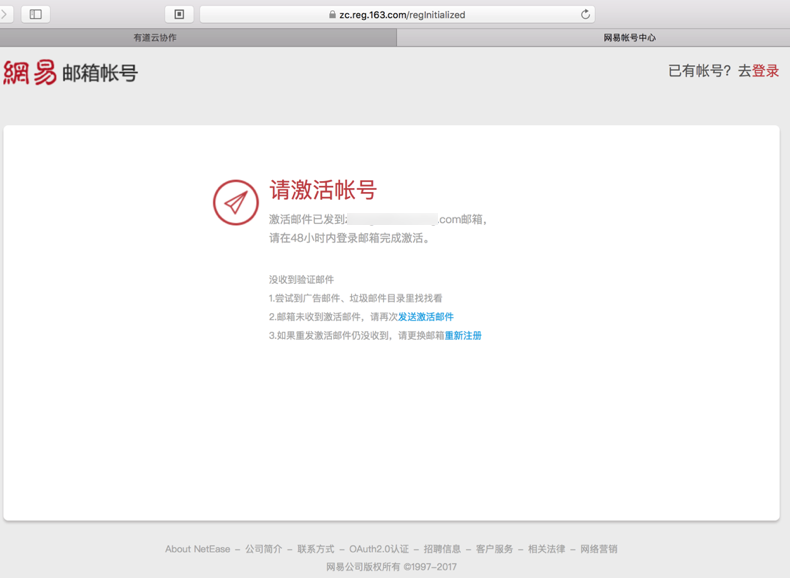

# 注册账号

## 关于**有道**的账号的说明

关于网易云协作的账号，由于网易已经做了一套账号系统，支持直接用网易邮箱账号登录旗下各种产品，所以：

* 如果你已有网易邮箱账号：可以**直接用网易邮箱**作为有道云协作的账号**去登录**，而无需单独注册
* 如果你没有网易邮箱账号：建议先去**注册一个网易账号**
    * 其实也可以直接用其他第三方账号，比如QQ，微信，微博等账号去（授权后）登录的，但是这会导致登录后系统自动生成的内部账号（一长串字符），不利于记和后续登录，所以还是推荐单独用网易账号去注册和使用比较好

## 网易账号注册过程

下面就去介绍，有道云协作的账号，即网易账号，的注册过程：

进入 [网易帐号中心](https://zc.reg.163.com/regInitialized)，选择**普通账号注册**，然后输入信息和验证码，发送验证码，填写验证码：

点击注册后，会显示**请激活账号**：

然后再去登录自己的邮箱去点击激活链接，即可激活，即可使用此账号。