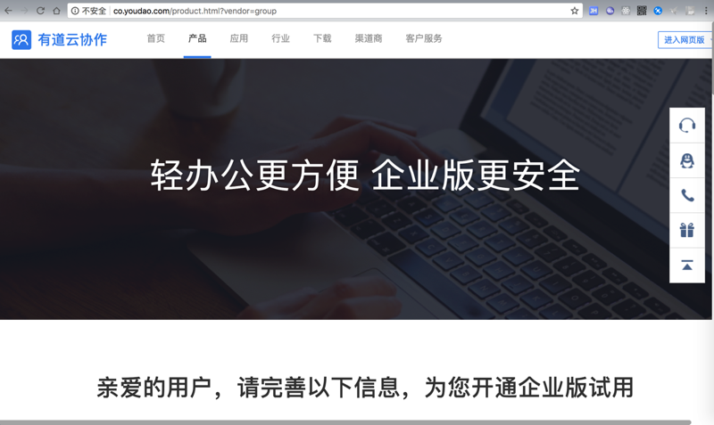
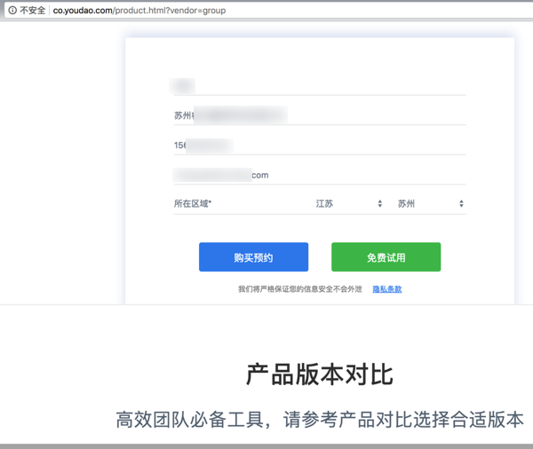
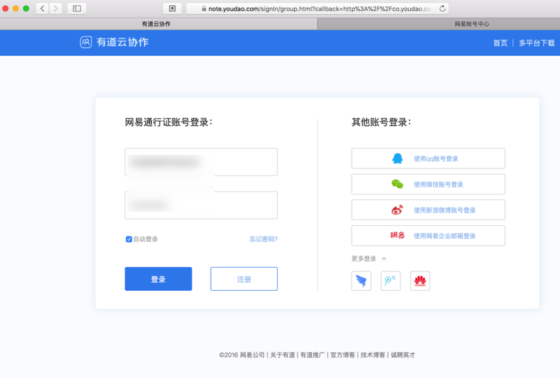
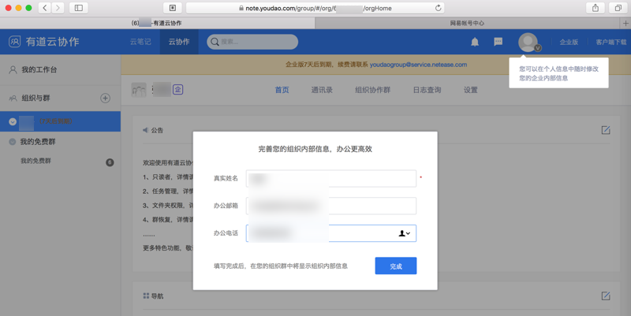

# 开通企业版

## 注册/激活企业版
在已经有了网易账号后，再去注册有道云协作的企业版：

进入 [有道云协作官网-产品](http://co.youdao.com/product.html?vendor=group)

然后继续填写团队/公司的信息

然后点击**免费试用**即可注册/激活成功。

注册后，即可去登录。

## 登录有道云协作
去登录 [有道云协作的web网页版](https://note.youdao.com/signIn/group.html)

登录后即可看到提示你完善信息：

> 另外会看到一个提示信息：
>
> **企业版7天后到期，续费请联系 youdaogroup@service.netease.com**
>
> 刚开始没看懂，后来大概明白了：
>
> 云协作有几个版本：免费版，团队版（年费398元/最多20人），企业版（年费每个人约398元）
>
> 而此处是免费版，以及包括后面购买了团队版，仍会提示**6天后过期**，其实是：
>
> 有道系统免费给了我们最高级别的**企业版**的7天的试用权限，到期后，应该就会回退到自己的（此处购买的团队版）版本的。
>
> 所以此处（已购团队版，所以）无需担心这个提示。
