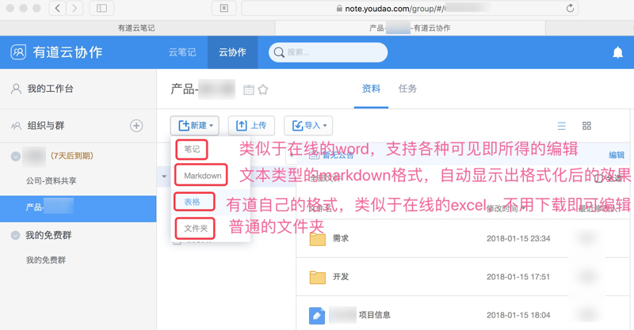
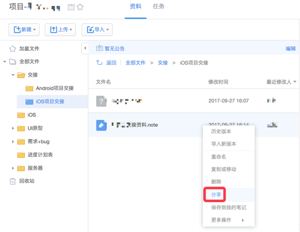
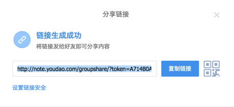
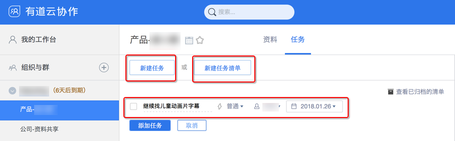
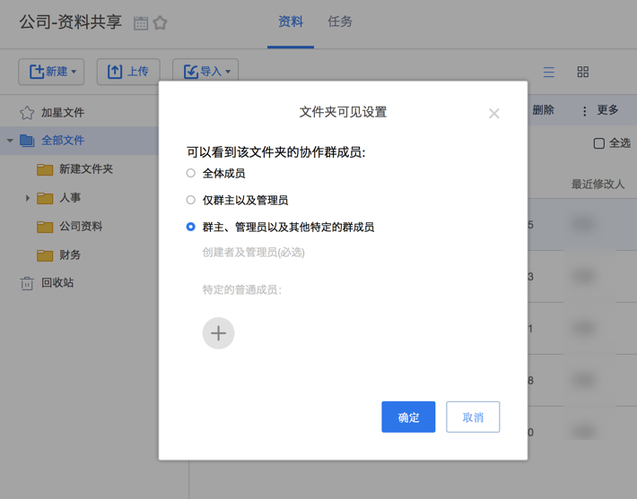

# 云协作的功能

此处单独整理介绍除了 有道云笔记和云协作 共有的功能之外，有道云协作单独有的功能：

## 新建多种格式
加入了对应组织，对应的群之后，就可以在群里面做操作了。

比如新建文件、文件夹等等内容了。

而云协作中可以新建多种格式：

下面就对几种基本格式进行简要介绍：
* `笔记`：类似于在线的`word`，可以直接查看和编辑。所见即所得。
    * 对于普通的人，只是用于记录普通内容的话，直接 新建 笔记 即可，就相当于word文档。笔记类型文件后缀是`.note`
* `Markdown`：易写易读的文本类的格式，支持编辑和预览。
    * 如果对于markdown熟悉的话，在不涉及图片的话，建议用markdown，更简洁方便。markdown类型后缀是`.md`
* `表格`：在线的类似于excel的表格，无需下载即可查看和编辑。
* `文件夹`：即普通的文件夹

当然，如果本身已写好对应文档在电脑中，比如word，excel等，可以直接上传文件即可。

## 支持批量上传
* 直接拖动单个文件/整个文件夹（包括其下所有子文件夹和文件），到有道中，即可上传
    * 且支持实时显示单个文件和整体的上传进度
    * 注意：Chrome才支持拖放，Mac的Safari不支持

> **[warning] 要客户端或Chrome浏览器才能支持拖放**
> * 独立客户端版本
>   * Windows的桌面版、Mac的桌面版，完美支持拖放。
> * Web网页版
>   * `Windows`：中的浏览器好像一般浏览器都支持拖放的
>   * `Mac`：用`Chrome`浏览器才支持拖放
>       * Mac中的`Safari`是不支持拖放的

## 如何给组织外的人分享内容
对于有道云协作中的内容，想要分享给外部的人，其实操作就类似于有道云笔记中普通的分享操作即可：

右击要分享的内容，选择`分享`：

即可弹框显示出分享地址（和对应二维码）

把地址拷贝发给别人，别人（当然也包括自己）即可在浏览器中（无需有道账号，无需登录有道的前提下即可）打开查看内容。

## 云协作支持任务
看到官网介绍 [有道云协作产品介绍](https://note.youdao.com/share/?token=ED1A3B41E9ED460CB5B11B47840D7076&gid=51708775&simple=true#/) 才注意到，原来云协作还支持任务功能的。

不过Web版不支持，只有PC客户端版本才支持。

具体位置是在：选中某个群后，和（大家共享的资料）并列有个**任务**，然后去新建**任务**或**任务清**单即可：

效果还是很不错的。

## 权限和可见度

如果遇到有些资料只希望部分人才能看到，那么有两种方式：

### 新建群，只把需要的人拉进去
然后新群里的内容就只能加入该群的人才能看到

### 新建文件夹设置可见性
在已有（其他同事都能看到公开的）群里新建文件夹，但设置该文件夹的可见性，只能让特定的人才能看到

> ** [warning] 创建者和所有管理员默认都可见 **
>
> 除了加入的特定的人能看到外，**创建者**和**所有管理员**都是**默认**能看到的
