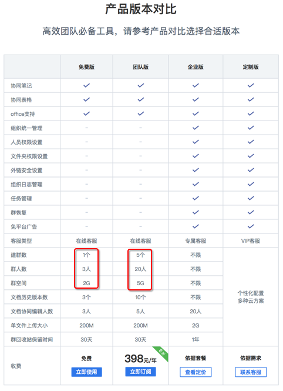
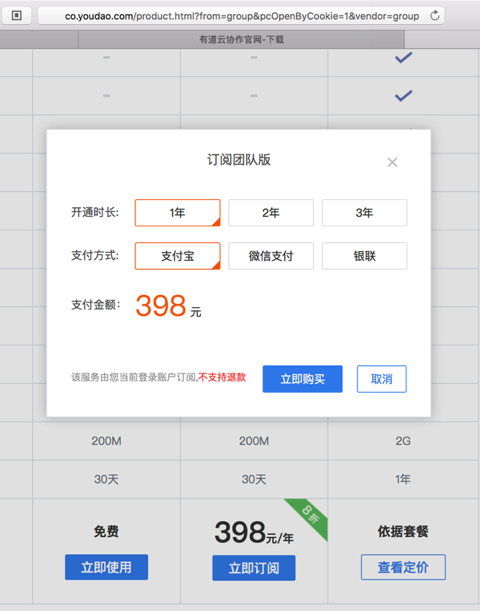
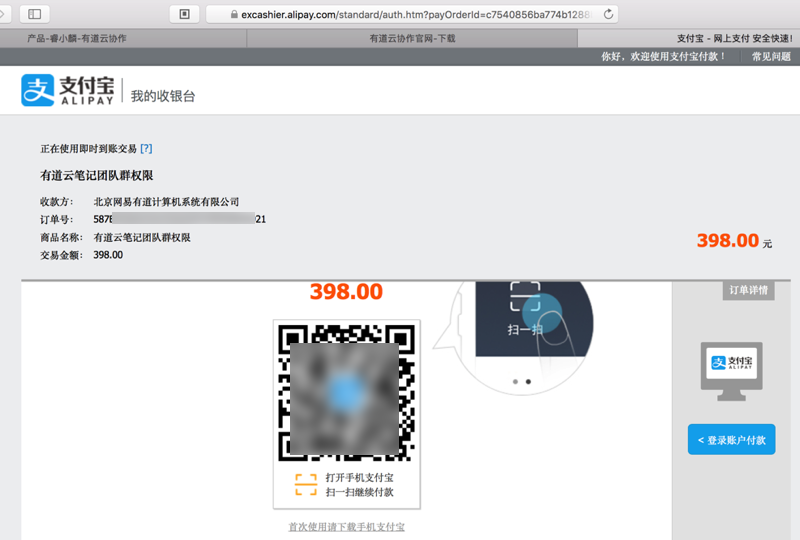
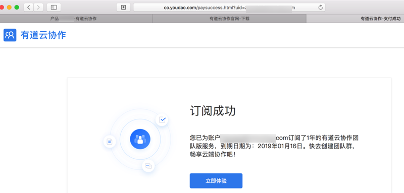
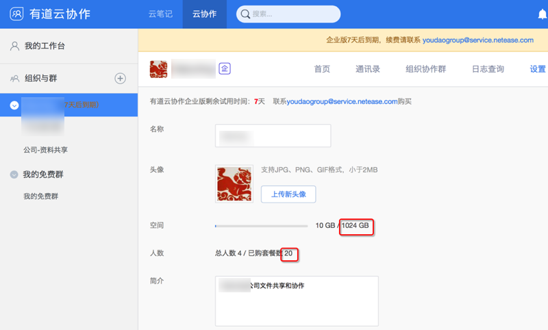
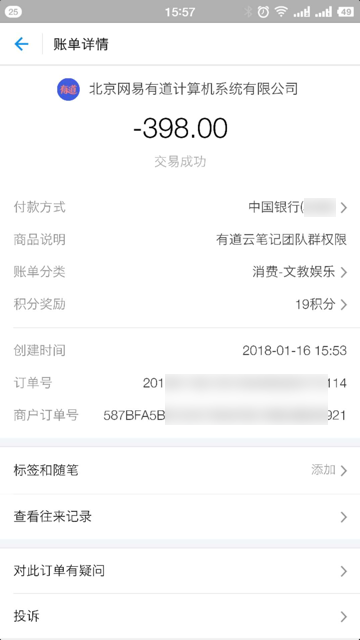

# 购买团队版或企业版

通过云协作的官网的产品介绍：
[有道云协作官网-产品](http://co.youdao.com/product.html?from=group&pcOpenByCookie=1&vendor=group)

得知有道云协作有如下几个版本：
* **免费版**：适合不超过3人的小团队
  * 人数不超过3人
  * 不超过1个群
  * 空间：2G
* **团队版**：适合不超过20人的中小团队
  * 人数不超过20人
  * 不超过5个群
  * 空间：5G
* **企业版**：适合中小公司
  * 按照账户个数付费
* **定制版**：适合土豪公司

由于是小团队，符合年费398元的团队版，所以决定去购买团队版。

## 购买**团队版**

点击**团队版**的`立即订阅`，显示出购买的支付方式：

选择自己需要的方式（支付宝），确定后，跳转到支付宝：

[支付宝 - 网上支付 安全快速！](https://excashier.alipay.com/standard/auth.htm?payOrderId=c7540856ba774b1288b1484465de8f71.20)

然后去扫码付款：

期间可以看到订单相关信息：

> 有道云笔记团队群权限
> * 收款方：北京网易有道计算机系统有限公司
> * 订单号：58xxxxxxxxxxxxxxxxxxxxxx21
> * 商品名称：有道云笔记团队群权限
> * 交易金额：398.00

即可购买。

购买成功后会提示 订阅成功：

登录云协作后，可以看到团队人数支持团队版的20人了：

对应的支付宝的支付信息：

> 突然发现空间好像直接支持1024G=1T了（不是介绍中说的只有5G）
>
> 后来才知道，原来是**试用企业版** 所导致空间如此之大，估计过几天试用过期，空间就变回团队版的5G了。
